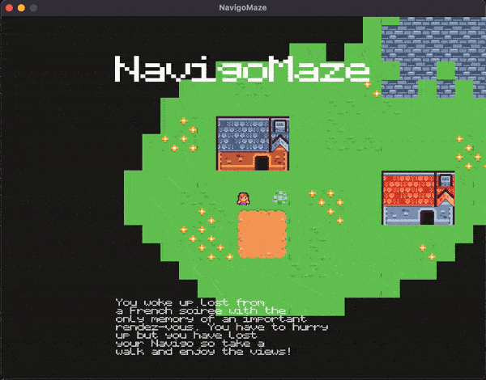

# Navigo-Maze
> Navigo-Maze is a obstacle-adventure game set in Paris, where you must navigate the city's streets while avoiding the cyclists.

## Table of Contents
- [Synopsis](#synopsis)
- [Features](#features)
- [How to Play](#how-to-play)
- [Installation](#installation)
- [Dependencies](#dependencies)
- [License](#license)

## Synopsis
After waking up lost from a French soirée, you’re in a rush to make it to an important rendezvous. With no Navigo card in hand, your only option is to walk your way there. But it won’t be easy, cyclists are **everywhere**, and you’ll need quick reflexes to avoid them!

Navigate the bustling streets, stay on your toes, and enjoy the journey. Can you make it to your meeting in one piece, or will the cyclists get the better of you?



## Features
- **Iconic Parisian neighborhoods:** Explore famous locations such as Montmartre, Châtelet, and more!

## How to Play
Use the arrow keys or WASD to move around the Parisian streets.

## Installation
> You can download the precompiled binaries for Windows and MacOS in the release section. However, if your platform is not listed, you can choose to build the project.

### Prerequisites
Please install GLEW and GLFW manually and edit the Makefile.

### Building the game
1. Clone and build the repository
```bash
git clone --recurse-submodules https://github.com/stantonik/navigo-maze.git
cd navigo-maze
make
```
2. Launch the game

You will find the binary in `./build/$YOUR_PLATFORM`. Good game !

## Dependencies
The game relies on the following third-party libraries:

- **GLEW:** OpenGL Extension Wrangler for handling OpenGL extensions.
- **GLFW:** Window and input management library.
- **cglm:** Lightweight math library for 3D applications.
- **jsmn:** A lightweight JSON parser.
- **uthash:** Hash tables.
- **stb:** Loading PNG images and texture atlases.
- **miniaudio:** Sound engine.

## License
This project is licensed under the Apache-2.0 License - see the [LICENSE](./LICENSE) file for details.
